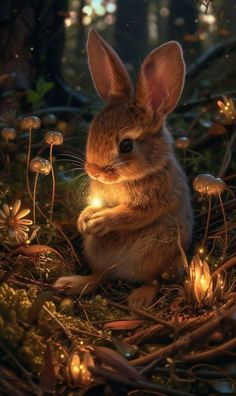

<html>

    <head>
        
    </head>

    <body>

        <button id="readTextButton">Seite vorlesen</button>

        

        <h2>Der Nussknacker und der Mäusekönig</h2>
        <h2>Նուշկոտն ու մկների թագավորը</h2>
        
<strong>Autor:</strong> E.T.A. Hoffmann

        
<strong>Հեղինակ:</strong> Է.Թ.Ա. Հոֆման

        
Clara, ein junges Mädchen, bekommt an Heiligabend einen Nussknacker als Geschenk. In der Nacht erwacht dieser zum Leben, und sie wird Zeugin eines Kampfes zwischen den Spielzeugsoldaten, angeführt vom Nussknacker, und dem Mäusekönig mit seinem Heer. Der Nussknacker rettet Clara und führt sie in ein magisches Reich voller Süßigkeiten und Wunder. Dort regiert die Zuckerfee, und Clara erlebt eine Welt voller Fantasie und Freude. Schließlich kehrt sie aus dem Traum zurück, und der Nussknacker bleibt eine besondere Erinnerung. Die Geschichte verbindet den Zauber von Weihnachten mit Mut, Freundschaft und der Macht der Fantasie.

        
Կլարան՝ երիտասարդ աղջիկը, Սուրբ Ծննդյան նախօրեին նվեր է ստանում Նուշկոտին։ Այդ գիշեր նա կենդանանում է, և Կլարան դառնում է մկանների թագավորի զորքի և խաղալիք զինվորների միջև կռվի վկա։ Նուշկոտը փրկում է Կլարային և տանում նրան հրաշքների աշխարհ, լի քաղցրավենիքով և կախարդանքով։ Այնտեղ իշխում է Շաքարի փերին, և Կլարան ապրում է երևակայության և ուրախության աշխարհում։ Վերջում նա վերադառնում է երազից, և Նուշկոտն անփոխարինելի հիշողություն է մնում։ Պատմությունը միավորում է Սուրբ Ծննդյան կախարդանքը՝ քաջության, ընկերության և երևակայության ուժի հետ։

        <h2>Wie der Grinch Weihnachten gestohlen hat</h2>
        <h2>Ինչպես Գրինչը գողացավ Սուրբ Ծնունդը</h2>
        
<strong>Autor:</strong> Dr. Seuss

        
<strong>Հեղինակ:</strong> Դոկտոր Սյուս

        
Der mürrische Grinch lebt in einer Höhle hoch oben in den Bergen und hasst Weihnachten. Er beschließt, den Feiertag der Bewohner von Whoville zu ruinieren, indem er sich als Weihnachtsmann verkleidet und alle Geschenke, Dekorationen und Festessen stiehlt. Doch am Weihnachtsmorgen singen die Menschen trotzdem fröhlich, was den Grinch erstaunt. Er erkennt, dass Weihnachten mehr als nur Geschenke ist, und sein Herz wird vor Freude größer. Schließlich bringt er alles zurück und feiert gemeinsam mit den Menschen. Die Geschichte zeigt die wahre Bedeutung von Weihnachten: Liebe, Gemeinschaft und Freude.

        
Գրինչը՝ մռայլ կերպարը, ապրում է բարձր լեռներում գտնվող քարանձավում և ատում է Սուրբ Ծնունդը։ Նա որոշում է փչացնել Whoville-ի բնակիչների տոնական օրը՝ ներկայանալով որպես Սանտա Կլաուս և գողանալով բոլոր նվերները, զարդարանքները և ուտելիքը։ Սակայն Սուրբ Ծննդյան առավոտյան մարդիկ շարունակում են երգել և ուրախանալ։ Գրինչը զարմանում է և հասկանում, որ Սուրբ Ծնունդը միայն նվերների մասին չէ։ Նրա սիրտը լցվում է երջանկությամբ, և նա վերադարձնում է ամեն ինչ ու նշում տոնը մարդկանց հետ։ Պատմությունը ցույց է տալիս Սուրբ Ծննդյան իրական իմաստը՝ սեր, համերաշխություն և ուրախություն։

        <h2>Weihnachten im Stall</h2>
        <h2>Սուրբ Ծնունդը ախոռում</h2>
        
<strong>Autor:</strong> Astrid Lindgren

        
<strong>Հեղինակ:</strong> Աստրիդ Լինդգրեն

        
Diese Geschichte erzählt die Weihnachtsgeschichte in einer einfachen, modernen Weise. Ein junges Paar sucht in einer verschneiten Nacht Schutz und findet Unterschlupf in einer alten Scheune. Dort wird ihr Kind geboren, umgeben von den warmen Atemzügen der Tiere. Die Geschichte wird aus der Perspektive einer Familie erzählt, die sie ihrem Kind näherbringt. Sie betont die Botschaft von Hoffnung, Liebe und dem Wunder des Lebens. Mit schlichten Worten und Bildern wird der Geist von Weihnachten lebendig und zugänglich für Kinder gemacht.

        
Այս պատմությունը Սուրբ Ծննդյան պատմությունն է ներկայացնում պարզ ու ժամանակակից ձևով։ Երիտասարդ զույգը ձյունածածկ գիշերը ապաստան է փնտրում և գտնում է մի հին ախոռ։ Այնտեղ ծնվում է նրանց երեխան՝ շրջապատված կենդանիների տաք շնչով։ Պատմությունը ներկայացվում է այնպիսի ընտանիքի կողմից, որը ցանկանում է այն փոխանցել իրենց երեխաներին։ Այն ընդգծում է հույսի, սիրո և կյանքի հրաշքի ուղերձը։ Պարզ բառերով և պատկերներով Սուրբ Ծննդյան ոգին դառնում է կենդանի և հասանելի երեխաների համար։

        <h2>Rudolph, das rotnasige Rentier</h2>
        <h2>Ռուդոլֆ՝ կարմիր քթով եղջերուն</h2>
        
<strong>Autor:</strong> Robert L. May

        
<strong>Հեղինակ:</strong> Ռոբերտ Լ. Մեյ

        
Rudolph ist ein Rentier mit einer auffällig roten, leuchtenden Nase, die ihn zum Gespött der anderen macht. Doch eines Weihnachtsabends, als dichter Nebel den Himmel bedeckt, bittet der Weihnachtsmann Rudolph, mit seiner Nase den Weg zu leuchten. Dank seines Mutes wird Rudolph der Held der Nacht, und die anderen Rentiere erkennen seinen Wert. Die Geschichte handelt von Individualität, Akzeptanz und dem Finden seines Platzes in der Welt. Rudolph wird zu einem Symbol für die Stärke, die aus vermeintlichen Schwächen entstehen kann.

        
Ռուդոլֆը եղջերու է, որը հայտնի է իր կարմիր, լուսավոր քթով, ինչը նրան դարձնում է մնացածի ծաղրի առարկան։ Սակայն մի Սուրբ Ծննդյան երեկո, երբ խիտ մառախուղը ծածկում է երկինքը, Սանտա Կլաուսը խնդրում է Ռուդոլֆին իր քթով լուսավորել ճանապարհը։ Իր քաջության շնորհիվ Ռուդոլֆը դառնում է գիշերվա հերոսը, և մնացած եղջերուները ճանաչում են նրա արժեքը։ Պատմությունը վերաբերում է անհատականությանը, ընդունելությանը և աշխարհում իր տեղը գտնելուն։ Ռուդոլֆը դառնում է խորհրդանիշ այն ուժի, որը կարող է ծնվել թվացյալ թուլություններից։

        <h2>Die schöne Fee</h2>
        <h2>Գեղեցիկ փերին</h2>
        
<strong>Autor:</strong> Lilith Bittlingmayer

        
<strong>Հեղինակ:</strong> Լիլիթ Բիթթլինգմայեր

        
In einem kleinen Dorf, umgeben von dichten Wäldern und leuchtenden Wiesen, lebte ein einfacher Junge namens Elias. Jeden Abend, wenn die Sonne hinter den Bergen verschwand, erzählten die Dorfbewohner am Lagerfeuer Geschichten über eine geheimnisvolle Fee, die tief im Wald lebte. Sie war nicht nur atemberaubend schön, sondern auch für ihre Güte und magischen Kräfte bekannt.

        Eines Tages, während Elias Holz für den Winter sammelte, entdeckte er einen glitzernden Pfad aus silbernen Blütenblättern. Neugierig folgte er dem Pfad, der ihn zu einer versteckten Lichtung führte. Dort, im Zentrum eines Teiches, stand sie – die schöne Fee. Ihr goldenes Haar funkelte wie die Morgensonne, und ihre Flügel schimmerten in allen Farben des Regenbogens.

        „Warum bist du hier, kleiner Mensch?“ fragte die Fee mit einer Stimme, die wie Musik klang.

        Elias senkte ehrfürchtig den Blick. „Ich habe nur den Blütenblättern gefolgt. Ich wollte dich nicht stören.“

        Die Fee lächelte sanft. „Es ist selten, dass ein Mensch diesen Ort findet. Du musst ein reines Herz haben.“

        Sie lud ihn ein, ihr von seinem Leben zu erzählen. Elias berichtete von den Sorgen des Dorfes: von der schlechten Ernte und der drohenden Hungersnot. Die Fee hörte aufmerksam zu und versprach, zu helfen.

        „Morgen früh, wenn die Sonne aufgeht, wird dein Dorf ein Wunder erleben. Doch denke daran, dass wahre Magie nur durch Dankbarkeit und Güte Bestand hat.“

        Am nächsten Morgen erwachten die Dorfbewohner und fanden ihre Felder voller reifer Früchte und goldenen Weizen. Die Menschen jubelten und feierten, doch Elias erinnerte sie an die Worte der Fee. Sie sollten die Geschenke teilen und die Natur mit Respekt behandeln.

        Von diesem Tag an lebten die Dorfbewohner im Einklang mit der Natur, und Elias besuchte die Lichtung gelegentlich, um der Fee zu danken. Die schöne Fee war glücklich, dass ihr Geschenk geschätzt wurde, und obwohl sie sich selten zeigte, wussten alle, dass sie über das Dorf wachte.
        

        

            Մի փոքրիկ գյուղում, որը շրջապատված էր խիտ անտառներով և փայլուն մարգագետիններով, ապրում էր մի հասարակ տղա՝ Էլիաս անունով։ Ամեն երեկո, երբ արևը մթնում էր լեռների հետևում, գյուղացիները խարույկի մոտ պատմում էին մի առեղծվածային փերիի մասին, ով ապրում էր խոր անտառում։ Ասում էին, որ նա ոչ միայն անհավանական գեղեցիկ էր, այլև հայտնի էր իր բարությամբ և կախարդական ուժերով։

            Մի օր, երբ Էլիասը ձմռան համար փայտ էր հավաքում, նա նկատեց արծաթե թերթիկներից կազմված մի փայլուն արահետ։ Հետաքրքրությունից դրդված, նա հետևեց արահետին, որն իրեն տարավ դեպի մի թաքնված բացատ։ Այնտեղ, մի լճակի կենտրոնում, նա տեսավ նրան՝ գեղեցիկ փերին։ Նրա ոսկե մազերը փայլում էին ինչպես առավոտյան արևը, իսկ թևերը շողում էին ծիածանի բոլոր գույներով։
            
            «Ինչո՞ւ ես այստեղ, փոքրիկ մարդուկ»,– հարցրեց փերին երաժշտության պես մեղմ ձայնով։
            
            Էլիասը հարգանքով իջեցրեց հայացքը։ «Ես պարզապես հետևեցի թերթիկներին։ Ես չէի ուզում ձեզ անհանգստացնել»։
            
            Փերին նրբորեն ժպտաց։ «Հազվադեպ է, որ մարդ գտնում է այս վայրը։ Դու պետք է որ մաքուր սիրտ ունենաս»։
            
            Նա հրավիրեց Էլիասին պատմել իր կյանքի մասին։ Էլիասը պատմեց գյուղի դժվարությունների մասին՝ վատ բերքի և մոտալուտ սովի սպառնալիքի։ Փերին ուշադիր լսեց և խոստացավ օգնել։
            
            «Վաղը առավոտյան, երբ արևը ծագի, ձեր գյուղը հրաշք կտեսնի։ Բայց հիշիր, իսկական կախարդանքը հնարավոր է միայն երախտագիտության և բարության շնորհիվ»։
            
            Հաջորդ առավոտ գյուղացիները զարթնեցին և իրենց դաշտերում գտան հասուն պտուղներով և ոսկեգույն ցորենով լի բերք։ Մարդիկ ուրախացան ու տոնեցին, բայց Էլ
        

        

        

        <h1>Lieder</h1>
        
Ich teile mit Euch meine allerliebsten Weihnachtslieder.

        
        <iframe width="560" height="315" src="https://www.youtube.com/embed/YpZ1egX7dfE?si=0QXID4zC1-natupX" title="YouTube video player" frameborder="0" allow="accelerometer; autoplay; clipboard-write; encrypted-media; gyroscope; picture-in-picture; web-share" referrerpolicy="strict-origin-when-cross-origin" allowfullscreen></iframe>

        <h1>Essen</h1>
        
Ich teile mit Euch meine allerliebsten Speisen.

        

        

        

            ich werde oich einen WAINACHTSBAUM und ain Geschenk zaigen.
        

        

            ich werde oich auch erzählen über WAIhNACHTEN.
        

        

            ich werde auch gedicht sagen.
        

        

        

            ich werde oich schöne Geschichten erzählen zum Beischpil eine Geschichte wo ich mir ausgedacht habe
        

        

            die schöne fee
        
        
            
        

        
        

        

        

        

        

        

        

        

        
        

    </body>

    

